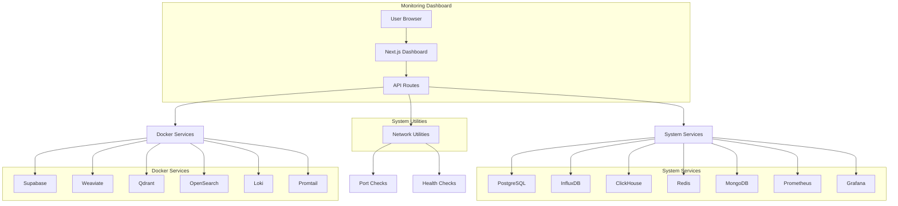

# Architecture Diagram

This diagram shows the architecture of the complete solution:

1. **User Browser** - Accesses the Next.js dashboard
2. **Next.js Dashboard** - Frontend application providing the user interface
3. **API Routes** - Backend endpoints that communicate with services
4. **System Services** - Services installed directly on the system
5. **Docker Services** - Services running in Docker containers
6. **System Utilities** - Network and health checking utilities